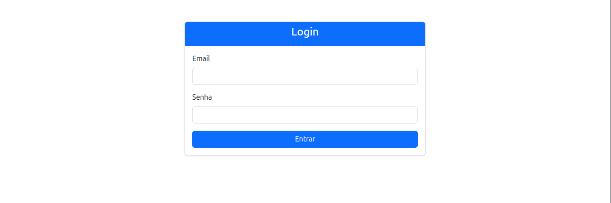
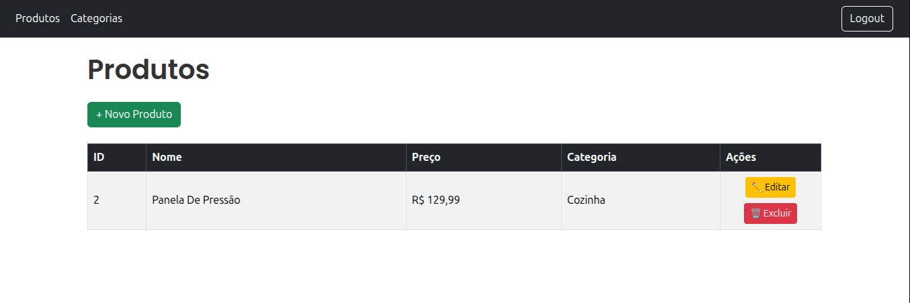
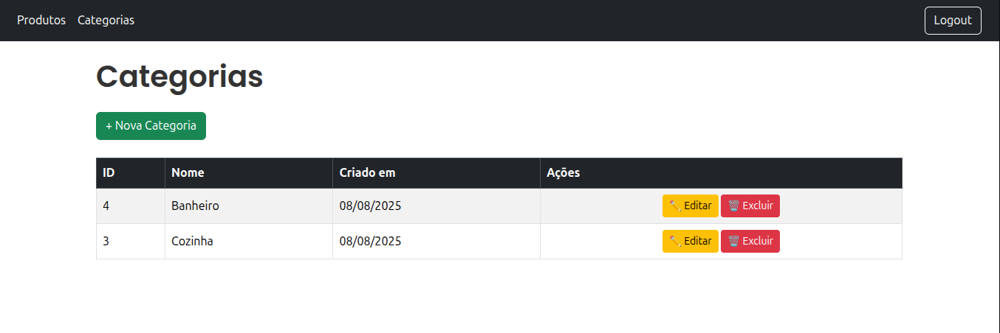

# 🗂️ Sistema Produtos

Este é um projeto sistema web desenvolvido com o framework **Laravel**. Ele permite o gerenciamento de **categorias** e **produtos**, com autenticação de usuários e utilização de **Docker** para facilitar a configuração do ambiente.

<h1 align="center"></h1>
<h1 align="center"></h1>
<h1 align="center"></h1>


## 🚀 Funcionalidades

- ✅ Login e autenticação de usuários

- 📂 CRUD completo de categorias

- 📦 CRUD completo de produtos

- 🔗 Associação entre produtos e categorias

- ✅ Validação de dados

- ✅ Mensagens de sucesso após ações (criação, edição, exclusão)

- 🔐 Rotas protegidas por autenticação


## 🛠️ Tecnologias utilizadas

- PHP 8
- Laravel 12
- Blade (template engine)
- Bootstrap
- MySQL
- Docker + Docker Compose

## 📦 Instalação

### 1. Clone o repositório:

```bash
git clone https://github.com/AAndersonSantos/products-laravel.git
cd products-laravel
```

### 2. Copie o arquivo .env.example para .env e configure suas variáveis de ambiente:
```bash
cp .env.example .env
```

### 3. Suba os containers:
```bash
docker-compose up -d --build
```

### 4. Instale as dependências PHP dentro do container:
```bash
docker exec -it nome-do-container-app composer install
```

### 5. Gere a chave da aplicação Laravel:

Esse comando gera uma chave de criptografia única para a sua aplicação Laravel e a armazena no arquivo de configuração de ambiente .env.
```bash
docker exec -it nome-do-container-app php artisan key:generate
```
### O que acontece?

- O Laravel cria uma chave aleatória e segura, no formato Base64.

- Essa chave é salva na variável APP_KEY dentro do arquivo .env.

- Exemplo de como ficará no .env:
```env
APP_KEY=base64:testetesteKZDP0hIMDOo6nSK5Ho+u88c+W+0xPjGUKV4=
```
### Por que isso é importante?

- Essa chave é usada para criptografar dados sensíveis da aplicação, como sessões e cookies.

- **Sem essa chave**, a criptografia do Laravel não funciona corretamente e a aplicação pode apresentar erros de segurança e autenticação.

- A chave deve ser única para cada ambiente e não deve ser alterada após a aplicação estar em uso, para evitar problemas com dados criptografados.

### 6. Rode as migrations:
```bash
docker exec -it nome-do-container-app php artisan migrate
```

### 7. Acesse no navegador:
```arduino
http://localhost:8000
```

### 👤 Acesso
Após subir o projeto, você precisa executar os seeders para que um usuário padrão seja criado no banco de dados.

### 🧪 Executando os seeders:
```bash
docker exec -it nome-do-container-app php artisan db:seed --class=UserSeeder
```
Esse comando irá criar automaticamente um usuário com as seguintes credenciais:

```m̀akefile
Email: anderson@gmail.com

Senha: admin123
```

### 💡 Importante:
O sistema **não possui rotas públicas de registro** (/register).
Para acessar a aplicação, utilize as credenciais acima ou crie novos usuários manualmente via banco de dados ou por meio de novos seeders personalizados.

### 🔧 Alterações simuladas

Foram realizadas duas mudanças estruturais no banco de dados para simular a evolução do projeto:

Adição do campo **order** na entidade **Categoria**

Tipo: **Integer**

Objetivo: definir a ordenação das categorias na listagem.

Adição do campo **show_in_showcase** na entidade **Produto**

Tipo: boolean

Objetivo: indicar se o produto deve ser exibido em uma vitrine promocional ou destaque.